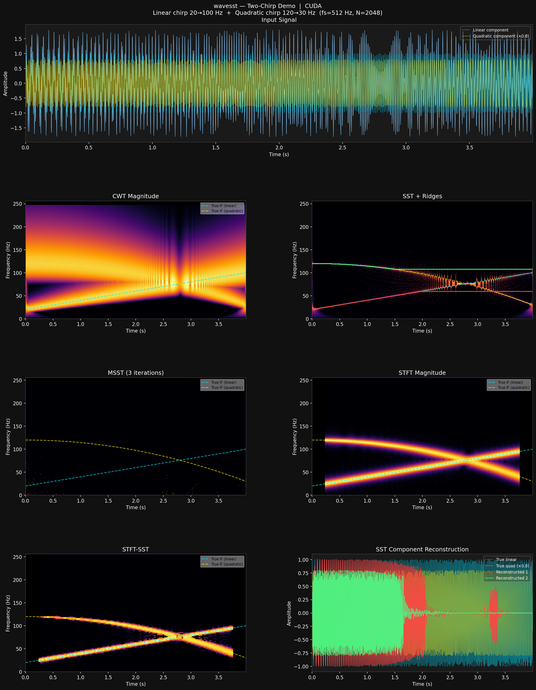

# wavesst

**GPU-native Synchrosqueezing Transform library for Python.**

> ⚠️ Work in progress — API is not yet stable.

wavesst provides fast, PyTorch-based implementations of the Continuous Wavelet
Transform (CWT) and its synchrosqueezed variants, designed for time-frequency
analysis of non-stationary signals.  All heavy computation runs on CUDA when
available; a `Config` object lets you control device, dtype, and VRAM budget
per call.

---



*Two crossing chirps: linear 20→100 Hz + quadratic 120→30 Hz.
From top-left: raw CWT, SST with extracted ridges, MSST (3 iterations),
STFT magnitude, STFT-SST, and CWT-SST component reconstruction.*

---

## Features

| Transform | Result type | Description |
|-----------|-------------|-------------|
| CWT | `CWTResult` | 4 wavelet families (Morlet, Bump, Paul, DOG); VRAM-aware chunked scale processing; optional `f_low`/`f_high` band-limiting |
| SST | `SSTResult` | Synchrosqueezed CWT via `scatter_add_` reassignment; all 4 wavelet families; `f_low`/`f_high` support |
| MSST | `MSSTResult` | True Pham-Meignen multi-synchrosqueezing (Tx-derived IF for iterations 2+) |
| Inverse CWT | — | `icwt()` — admissibility-formula reconstruction with optional bandpass denoising |
| STFT | `STFTResult` | GPU-native windowed FFT |
| STFT-SST | `STFTSSTResult` | STFT synchrosqueezing; exact IF via window-derivative (no finite-difference error) |
| Ridge extraction | `Ridge` | Dynamic-programming ridge tracker (Cython); energy_path per timestep |
| Reconstruction | `Component` | Inverse CWT-SST (admissibility) + STFT-SST (overlap-add) |
| Signal synthesis | — | `make_chirp`, `make_amfm`, `make_noise` — linear/quadratic/arbitrary-IF chirps, AM/FM signals, white/pink/brown/impulsive noise |
| Onset detection | `OnsetResult` | `detect_onsets()` — ridge energy thresholding for component start/stop |
| Masked ridge extraction | `Ridge` | `extract_ridges_masked()` — frequency-band constrained ridge DP |
| Parallel ridge extraction | `list[Ridge]` | `extract_ridges_parallel()` — band-decomposed concurrent extraction |

---

## Quick start

```python
import numpy as np
import wavesst

# Sample signal: two pure tones
fs = 256.0
t  = np.arange(1024) / fs
x  = np.cos(2 * np.pi * 32 * t) + np.cos(2 * np.pi * 80 * t)

# CWT → SST → ridge extraction → reconstruction
cfg        = wavesst.Config(device='auto', dtype='complex64')
sst_result = wavesst.sst(x, fs=fs, nv=32, gamma='auto', cfg=cfg)
ridges     = wavesst.extract_ridges(sst_result, n=2, penalty=1.0)
components = wavesst.reconstruct(sst_result, ridges)

print(f"Ridge 1 median: {np.median(ridges[0].freq_path):.1f} Hz")
print(f"Ridge 2 median: {np.median(ridges[1].freq_path):.1f} Hz")
```

### Alternative wavelet families

```python
# Bump wavelet — compact support in frequency domain
cwt_bump = wavesst.cwt(x, fs=fs, nv=32, wavelet='bump', cfg=cfg)

# Paul wavelet (order 4) — good time localisation
cwt_paul = wavesst.cwt(x, fs=fs, nv=32, wavelet='paul', wavelet_order=4, cfg=cfg)

# DOG (derivative of Gaussian, order 2) — symmetric, smooth
cwt_dog  = wavesst.cwt(x, fs=fs, nv=32, wavelet='dog',  wavelet_order=2, cfg=cfg)
```

### Bandpass denoising with icwt

```python
# CWT of a noisy signal, then reconstruct only the band of interest
cwt_result = wavesst.cwt(noisy, fs=fs, nv=32, cfg=cfg)
x_clean    = wavesst.icwt(cwt_result, f_low=20.0, f_high=110.0)
```

### STFT-SST

```python
stft_result = wavesst.stft_sst(x, fs=fs, nperseg=256, noverlap=240,
                                gamma='auto', cfg=cfg)
ridges      = wavesst.extract_ridges(stft_result, n=2)
components  = wavesst.reconstruct(stft_result, ridges, fs=fs)
```

### Config options

```python
# Force CPU, double precision
cfg = wavesst.Config(device='cpu', dtype='complex128')

# Limit VRAM usage (useful on small GPUs)
cfg = wavesst.Config(device='auto', vram_budget_gb=4.0, safety_factor=0.8)

# Temporary override for one call
with cfg.temporary(dtype='complex128'):
    result = wavesst.cwt(x, fs=fs, cfg=cfg)
```

---

## Installation

wavesst uses Cython extensions; you need a C compiler.

```bash
# Clone and install in editable mode
git clone https://github.com/TimothySto/wavelets-3.git
cd wavelets-3
pip install -e . --no-build-isolation

# Optional extras
pip install -e ".[dev]"        # pytest, hypothesis, benchmark
pip install -e ".[reference]"  # ssqueezepy + PyWavelets for validation tests
pip install -e ".[cuda]"       # cupy for CUDA (torch CUDA included via torch)
```

### Requirements

- Python ≥ 3.10
- numpy ≥ 1.24, scipy ≥ 1.11
- torch ≥ 2.1 (CPU or CUDA)
- matplotlib ≥ 3.7, ipywidgets ≥ 8.0 (for interactive notebook plots)
- A C compiler for Cython extensions (MSVC on Windows, GCC on Linux/macOS)

---

## Notebooks

Six notebooks live in `notebooks/`, each runnable end-to-end:

| Notebook | Contents |
|----------|----------|
| `00_wavesst_full_demo.ipynb` | Full pipeline: signal synthesis → CWT → SST → MSST → STFT-SST → ridges → reconstruction → `icwt` bandpass denoising |
| `01_cwt_sst.ipynb` | CWT deep dive: pure-tone energy profile, gamma threshold effect, voice density (`nv`), CWT vs SST vs MSST comparison |
| `02_stft_stft_sst.ipynb` | STFT vs STFT-SST: window effects, Gini concentration comparison, ridge extraction, reconstruction |
| `03_msst.ipynb` | MSST deep dive: SST vs MSST concentration (Gini), iteration effect (1–3 passes), true Pham-Meignen formulation |
| `04_signal_synthesis.ipynb` | Signal synthesis: linear/quadratic/arbitrary-IF chirps, gated signals, noise colours (white/pink/brown/impulsive), SST analysis of noisy signals |
| `05_ridge_reconstruction.ipynb` | Ridge extraction methods: standard, masked, parallel; onset detection; reconstruction fidelity for multi-component signals |

All plots are interactive (requires `ipywidgets ≥ 8.0`).

---

## Running tests

```bash
# Full suite (206 tests)
pytest tests/ -q

# Unit tests only
pytest tests/unit/ -q

# Cross-validation against pywt / ssqueezepy (requires extras)
pytest tests/validation/ -v
```

---

## Project layout

```
src/wavesst/
├── config.py                  # Config dataclass + module singleton
├── transforms/
│   ├── cwt.py                 # CWT (chunked, GPU-native; Morlet/Bump/Paul/DOG; f_low/f_high)
│   ├── sst.py                 # SST (scatter_add_ reassignment; all wavelet families)
│   ├── msst.py                # Multi-synchrosqueezing (true Pham-Meignen, iterative)
│   ├── stft.py                # STFT (GPU-native rfft framing)
│   ├── stft_sst.py            # STFT-SST (window-derivative IF estimator)
│   ├── wavelets.py            # Bump, Paul, DOG filter banks (frequency domain)
│   └── icwt.py                # Inverse CWT via admissibility formula
├── synthesis/
│   ├── chirp.py               # make_chirp, make_amfm — chirp and AM/FM signal generators
│   └── noise.py               # make_noise — white, pink, brown, impulsive noise
├── analysis/
│   ├── ridge.py               # Ridge extraction: extract_ridges, extract_ridges_masked
│   ├── onset.py               # detect_onsets — energy-threshold onset/offset detection
│   ├── parallel.py            # extract_ridges_parallel — band-decomposed concurrent extraction
│   └── reconstruction.py      # Inverse transform → Component
├── viz/
│   ├── tf_plot.py             # Static plots: plot_cwt, plot_sst, plot_ridges, plot_components
│   └── interactive.py         # ipywidgets wrappers: iplot_cwt, iplot_sst, iplot_ridges, …
└── _core/
    ├── filters.pyx            # Cython: Morlet filter bank
    └── ridge_dp.pyx           # Cython: ridge DP solver
```

---

## Mathematical background

### Synchrosqueezed CWT (SST)

**Synchrosqueezing** (Daubechies & Maes 1996; Thakur & Wu 2011) sharpens a
time-frequency representation by *reassigning* each coefficient to the
instantaneous frequency it estimates, rather than the analysis frequency at
which it was computed.

For the CWT-based SST the instantaneous frequency estimator is:

```
ω̂(a, t) = Re(-i · ∂_t W_x(a, t) / W_x(a, t))
```

and the reassigned representation is:

```
T_x(f, t) = (log 2 / nv) · Σ_{a : |ω̂(a,t) − f| < Δf/2}  W_x(a, t)
```

### Multi-Synchrosqueezing (MSST)

The true Pham-Meignen (2017) formulation iterates the squeezing step.
For passes k ≥ 2 the IF is re-estimated directly from the previous output T_x^{k−1}
rather than from W, sharpening ridges progressively:

```
ω̂^k(ξ, t) = Re(-i · ∂_t T_x^{k-1}(ξ, t) / T_x^{k-1}(ξ, t))
```

where the time derivative is computed exactly via FFT:

```
∂_t T_x = IFFT[ iω · FFT[T_x] ]
```

### Inverse CWT (icwt)

For this library's CWT convention (no √a normalisation), reconstruction uses:

```
x(t) = (da_ratio / K_ψ) · Re[ Σ_a W(a, t) ]

K_ψ = (1/2) · ∫_0^∞ ψ̂(ω) / ω  dω
```

With optional `f_low`/`f_high`, scales outside the band are zeroed before
summing — giving a simple but effective bandpass denoising path.

### CWT-SST Reconstruction

```
x_k(t) = (2 / C_ψ) · Re[ Σ_{f ∈ band_k(t)}  T_x(f, t) ]
```

### STFT-SST

For STFT-SST the IF is estimated from the window derivative:

```
∂_τ V_x(η, τ) = −V_{g'}(η, τ)     (exact, no finite-difference error)
ω̂(η, τ)       = η + Im(∂_τ V_x / V_x) / (2π)
```

Reconstruction uses overlap-add synthesis on `V` at the ridge bin (not `T_x`)
to avoid Poisson-sum cancellation from the Hann window's leakage structure.

---

## References

- Daubechies, I. & Maes, S. (1996). *A nonlinear squeezing of the continuous
  wavelet transform based on auditory nerve models.*
- Thakur, G. & Wu, H.-T. (2011). *Synchrosqueezing-based recovery of
  instantaneous frequency from nonuniform samples.*
- Daubechies, I., Lu, J. & Wu, H.-T. (2011). *Synchrosqueezed wavelet
  transforms: an empirical mode decomposition-like tool.*
- Oberlin, T., Meignen, S. & Perrier, V. (2014). *The Fourier-based
  synchrosqueezing transform.*
- Pham, D.-H. & Meignen, S. (2017). *High-order synchrosqueezing transform
  for multicomponent signals analysis.*

---

## Status

This library was built session-by-session as a focused project in GPU-accelerated
time-frequency analysis.  It is functional, tested, and growing — but the API
is not yet frozen and breaking changes may occur before v1.0.

**Implemented:**
- CWT, SST, STFT, STFT-SST, MSST (true Pham-Meignen), inverse CWT (`icwt`)
- Morlet, Bump, Paul, DOG wavelet families
- Frequency-band-limited scale selection (`f_low` / `f_high`)
- Dynamic-programming ridge extraction and component reconstruction
- Signal synthesis: `make_chirp` (linear/quadratic/arbitrary-IF/piecewise), `make_amfm`, `make_noise` (white/pink/brown/impulsive)
- `detect_onsets()` — ridge energy thresholding for component start/stop detection
- `extract_ridges_masked()` — frequency-band constrained ridge extraction
- `extract_ridges_parallel()` — band-decomposed concurrent ridge extraction
- Full `ipywidgets` interactive visualization layer
- 6 tutorial notebooks covering the full transform + synthesis + analysis pipeline

**Planned (Session 9+):**
- Large-scale characterisation framework with multiprocessing runner and SQLite/Parquet result database
- Additional ridge extraction methods (probabilistic, penalised spline)
- Save/load utilities for transform results
- Sphinx documentation
